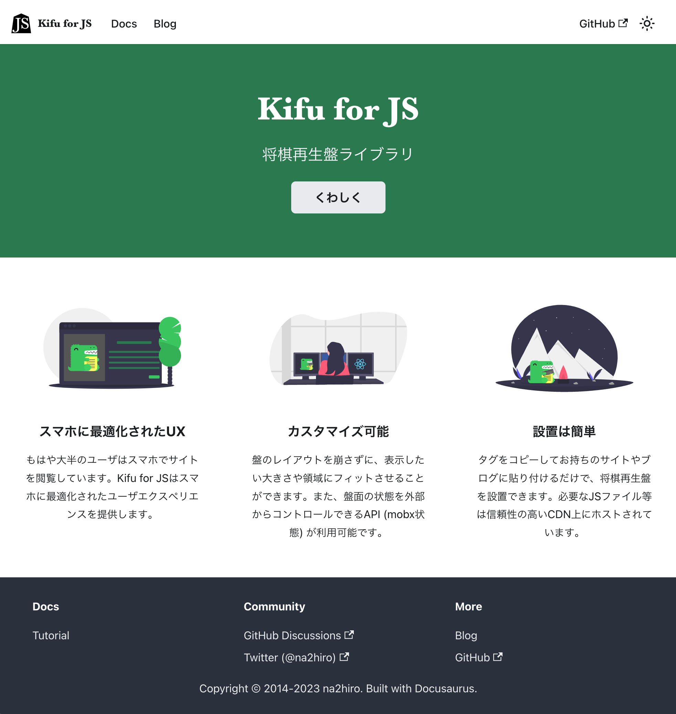

# Kifu for JS monorepo [](https://www.jsdelivr.com/package/npm/kifu-for-js)  [](https://opensource.org/licenses/MIT)

<font size=4>[Kifu for JS 公式サイトはこちら](https://kifu-for-js.81.la)</font>

[](https://kifu-for-js.81.la)

## このリポジトリについて

Kifu for JSと関連ライブラリのmonorepoです。個々のパッケージのREADMEは各パッケージのディレクトリにあります。

* [`kifu-for-js`](packages/Kifu-for-JS#readme): Kifu for JS 将棋再生盤とブックマークレット
* [`json-kifu-format`](packages/json-kifu-format#readme): JSON棋譜フォーマットと関連ライブラリ
* [`shogi.js`](packages/shogi.js#readme): 将棋の盤駒を扱うライブラリ
* [website](website): 公式サイト (https://kifu-for-js.81.la)

## 開発

このリポジトリは、npm packagesとlernaによるmonorepo環境です。

### パッケージ依存関係

* `shogi.js` <- `json-kifu-format` <- `kifu-for-js` <- `website`
* `shogi.js` <- `kifu-for-js`

### 準備

1. `nvm i && nvm use` としてnpmを用意します。（nvm が必要です。）
2. ルートディレクトリで`npm install`を実行すると、各パッケージの依存関係がインストールされます。

### 開発ワークフロー

1. ルートディレクトリで `npm run dev` を実行すると、各パッケージがビルドされ、変更があると自動的にビルドが再実行されます。
2. パッケージの開発を行います。都度ブラウザで動作を確認します。
3. テストを書きます。 `npm run test` でテストを一括実行します。また、個々のパッケージで変更を監視しながらテストを実行するには、個々のパッケージに移動して（例：`cd /packages/Kifu-for-JS`） `npm run test:watch` を実行します。
4. `npm run lint:fix` として、修正可能なものは修正しつつLintを実行します。 
5. プルリクエストを作成します。ブランチでビルドが走り、テストがパスすることを確認します。

#### 新たなライブラリをインストールする

* 全てのパッケージに対してインストールする場合は、ルートディレクトリで `npm install (ライブラリ名)` を実行します。
* 個々のパッケージに対してインストールする場合は、ルートディレクトリで `npm install (ライブラリ名) -w (インストール先パッケージ名)` を実行します。

### npmスクリプト

<!-- A table of npm scripts, based on package.json -->

| `npm run ...` | 説明                                                        |
|---------------|-----------------------------------------------------------|
| `lint`        | すべてのパッケージのlintを行う                                         |
| `lint:fix`    | すべてのパッケージのlintを行い、修正可能なものは修正する                            |
| `test`        | すべてのパッケージのテストを行う                                          |
| `build`       | すべてのパッケージをビルドする                                           |
| `dev`         | すべてのパッケージをビルドしてexampleページを起動し、変更を監視する                     |
| `website`     | すべてのパッケージをビルドして公式サイトを起動し、公式サイトへの変更を監視する（ライブラリへの変更は監視しません） |
| `cy:open`     | exampleページに対して統合テストを行う                                    |

### リリースワークフロー (na2hiro向け)
1. `bump` GitHub Actions でパッケージのバージョンを上げる
2. リリースページからリリースを生成
3. `publish` GitHub Actions がリリースをビルド・公開する
4. [jsDelivrのcacheをパージする](https://www.jsdelivr.com/tools/purge)
```
https://cdn.jsdelivr.net/npm/kifu-for-js@5/bundle/kifu-for-js.min.js
https://cdn.jsdelivr.net/npm/kifu-for-js@5/bundle/public-bookmarklet.min.js
```
