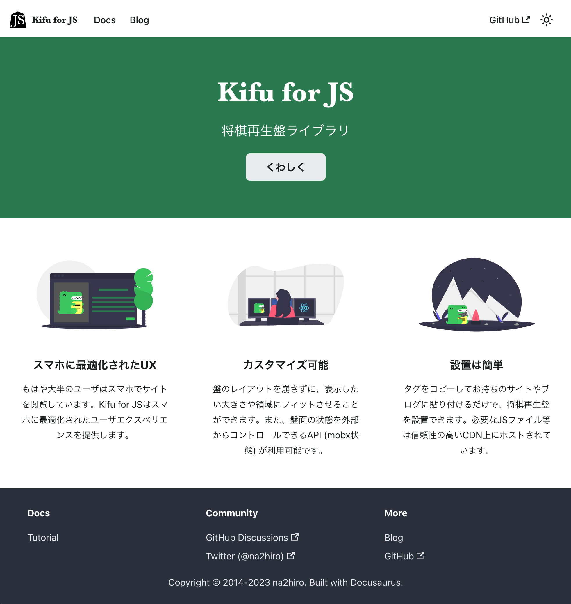

# Kifu for JS  [](https://github.com/na2hiro/Kifu-for-JS/actions/workflows/gh-pages.yml) [](https://opensource.org/licenses/MIT) [](https://badge.fury.io/js/kifu-for-js)
モバイルフレンドリーな将棋の棋譜再生盤

## Kifu for JS 将棋再生盤

詳しくは[Kifu for JS 公式サイト](https://kifu-for-js.81.la)をご覧ください。

[](https://kifu-for-js.81.la)

## デモ

公式サイトの [Kifu for JSについて](https://kifu-for-js.81.la/docs/) からどうぞ。

## 更新ログ / バージョン
[Releases](https://github.com/na2hiro/Kifu-for-JS/releases) からどうぞ。

## ライセンス

Kifu for JS は MIT ライセンスの下で公開されています。詳しくは [LICENSE.txt](LICENSE.txt) をご覧ください。噛み砕いて言うと、著作権表示等を残していただければ、商用利用も含めて自由に使用・改変・再配布できます。

* [shogizumen.js by maasa](http://maasa.g2.xrea.com/shogizumen/) under MIT License
* [Material Symbols by Google](https://fonts.google.com/icons) under Apache License 2.0
* (旧版のみ) [Shogi images by muchonovski](http://mucho.girly.jp/bona/) below `images` directory are under a [Creative Commons 表示-非営利 2.1 日本 License](http://creativecommons.org/licenses/by-nc/2.1/jp/).

## ご意見・ご要望

* 要望やバグ報告は [issues](https://github.com/na2hiro/Kifu-for-JS/issues) へよろしくお願いします。
* 棋譜形式の対応には注意を払っていますが、もし動作しない棋譜がありましたら対応しますので、Twitterやissuesでご報告いただければ幸いです。
* 棋譜形式そのものについては [JSON棋譜フォーマット](../json-kifu-format#readme) もご参照ください。

## 開発

主な情報は[monorepoトップのREADME](../../README.md#開発)をご覧ください。`kifu-for-js`固有の情報は以下の通りです。

### 関連ツール・ライブラリ

* [na2hiro/json-kifu-format](../json-kifu-format): 将棋の棋譜を扱うライブラリ
* [na2hiro/Shogi.js](../shogi.js): 将棋の盤駒を扱うライブラリ
* TypeScript
* React
* React DnD
* MobX
* Webpack (バンドルツール)
* Jest (テストフレームワーク、カバレッジ計測)
* Cypress (end-to-endテスト)
* ESLint (Linter)

### E2E テスト

```shell
npm run cy:open
```

開発サーバが立ち上がっている状態(例えば`npm run dev`の後)でCypressによるend-to-end (E2E)テストを行えます。 実際のブラウザの様子を確認でき、ソースまたはテストコードが変更されるたびに走ります。
