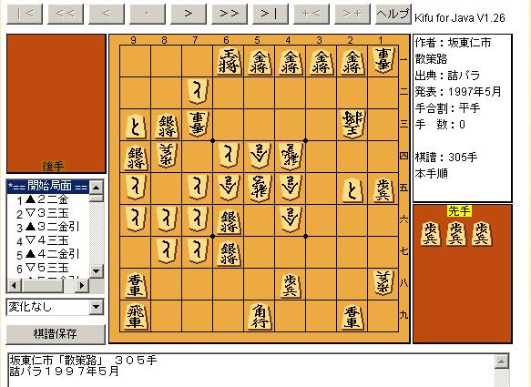
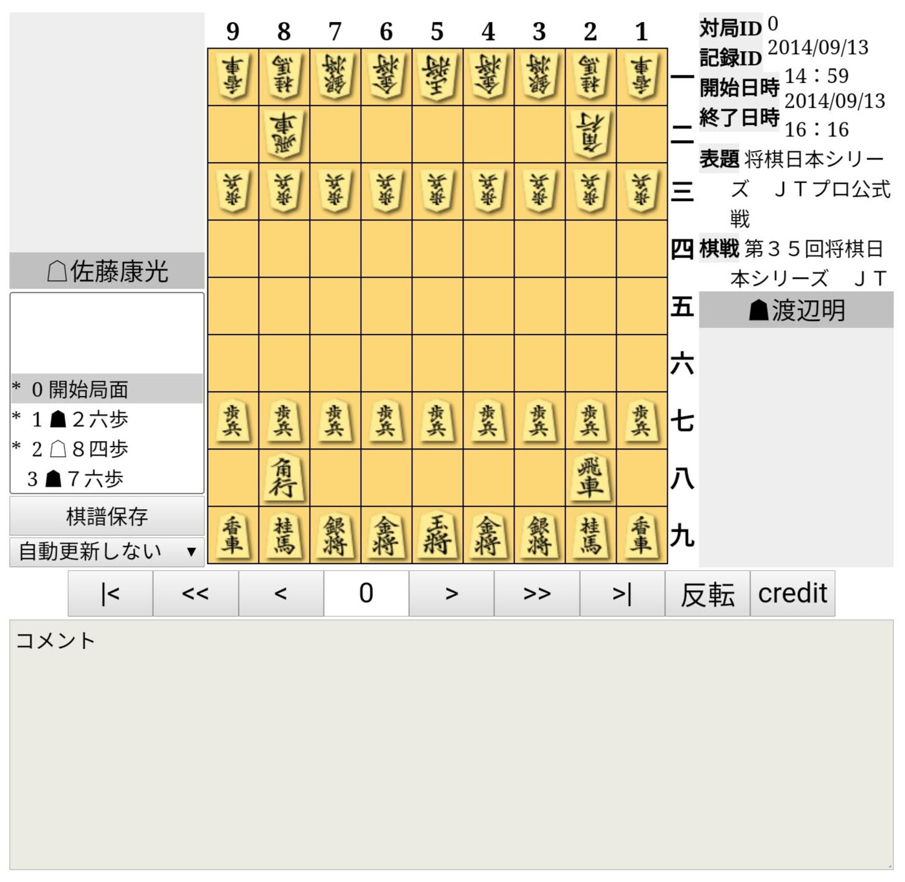

<><blockquote className="twitter-tweet">
Kifu for JSをモバイルフレンドリーかつ美しくしている。  左：Kifu for JS Lite (仮)。盤面タップで進む戻る、棋譜スクロールで進む戻る、表示領域に自動フィット 右：現在。2000年代からあるKifu for Java/Flashと似たような見た目を今まで継承 <a href="https://t.co/qkVVCBP1Lh">pic.twitter.com/qkVVCBP1Lh</a>
&mdash; @na2hiro@mstdn . jp 💿 93連休 (@na2hiro) <a href="https://twitter.com/na2hiro/status/1687415028532891648?ref_src=twsrc%5Etfw">August 4, 2023</a></blockquote> <Script async src="https://platform.twitter.com/widgets.js" charset="utf-8" />
    </>

ついに、モバイル端末でのユーザビリティを追求した将棋再生盤ライブラリKifu for JS v5がリリースされました！

v5の特徴は次の通りです：

<!--truncate-->

* **スマホに最適化されたUX** (以下のスクリーンキャプチャを参照)
* **カスタマイズ可能**
* **設置は簡単**

  <video controls="controls" loop name="スクロールして再生" width="100%" style={{maxWidth: "400px"}}>
    <source src="/img/scroll-to-play.mp4" />
  </video>

Kifu for JS について詳しくは、ぜひ同時に公開された[公式サイト](/)をお確かめください。Kifu for JS自体の紹介はそちらに譲るとして、ここでは今回のv5リリースに至るまでの経緯をご紹介します。

### Kifu for JS v4までの歩み

2000年代から2010年代前半にかけて、将棋ソフト界の第一人者である柿木さんによって作られた将棋再生盤Kifu for JavaとKifu for Flashが一般的でした。タイトル戦等の棋譜中継や将棋サイトの解説や棋譜掲載などはこれらが使われていました。それぞれJavaアプレットとFlashという技術が使用されていました。

ところが、2010年代前半にこれらのサイトは技術的な問題を抱えることになりました。それは、スマートフォンが広まり、スマートフォンでは将棋盤が表示されないという問題です。JavaアプレットやFlashはセキュリティ上の理由で縮小・廃止されていく流れにあり、WebアプリはJavaScript (JS)で作られるようになっていったのです。

そんな中、2014年にna2hiroがKifu for JSを公開。それ以来Kifu for JSは、Kifu for Java/Flashとの互換性を重視しほぼ似たような見た目と機能を持ち、将棋サイト運営者への助けとなるよう提供されてきました。また、同時に提供されたKifu for JS ブックマークレットは、まだKifu for Java/Flashが設置されているサイトをスマホ等で見たいユーザがKifu for JSを各自読み込めるよう直接手助けするものでした。

実際2015年にパソコンのブラウザでもJavaアプレットサポート打ち切りの波がありそれを捉えることはできたものと考えます。その後Flash盤はパソコンでは動作するものの、スマホユーザの割合は右肩上がりで、2020年末にFlashサポート打ち切りがある以前も含めてKifu for JSは将棋サイト運営・閲覧の一助となってきたのではないかと考えます。

### Kifu for JS v4の問題点と、v5での改善点

技術的問題への解決策を提供するKifu for JSでしたが、大きく2つの問題がありました。

1. 見た目が美しくない
2. スマホで使いづらい

詳細は[Kifu for JS legacy 版について](/docs/legacy)で説明していますが、Kifu for JSが美しくないことに加えてサイトのデザインとの干渉などもあり、実際に設置されたものがなかなか綺麗にならないケースが多く見られたように感じます。また、Kifu for Java/Flashとの互換性を保持したためモバイルでのユーザビリティは考慮されていませんでした。

Javaアプレットの終焉（2015年頃）、Flashの終焉（2020年頃）からしばらく経ち、Kifu for Java/Flashと同じUIにこだわる理由はありません。先述の問題をどちらとも改善したのが、[Kifu for JS 最新版](/)です。legacy版(Kifu for JS@3かそれ未満)をご利用のサイト運営者の方は、旧版との併用の道も用意されていますので、ぜひ[Kifu for JS v5への移行](/docs/migration-from-4-to-5)をお考えください。不明な点やご質問は[@na2hiro](https://twitter.com/na2hiro)までお寄せください。

### Kifu for JSのこれから

Kifu for JS v5は必要な機能を揃えているつもりですが、今後も継続的に改善・機能追加を続けていく予定です。具体的には次のような機能を検討しています。ご要望などあればぜひ[@na2hiro](https://twitter.com/na2hiro)まで、あるいは[GitHub issues](https://github.com/na2hiro/kifu-for-js/issues)までお寄せください。

- [ ] 詰将棋に特化した表示モード（持ち駒や手番表示の調整、解答を伏せておく機能など）
- [ ] リアルな盤駒表示モード（色付き盤、駒画像を使った従来に近い表示）
- [ ] 棋譜情報の表示（表題や棋戦名などの表示）
- [ ] 中継機能（棋譜の自動再読み込み）

### おわりに

TODO
