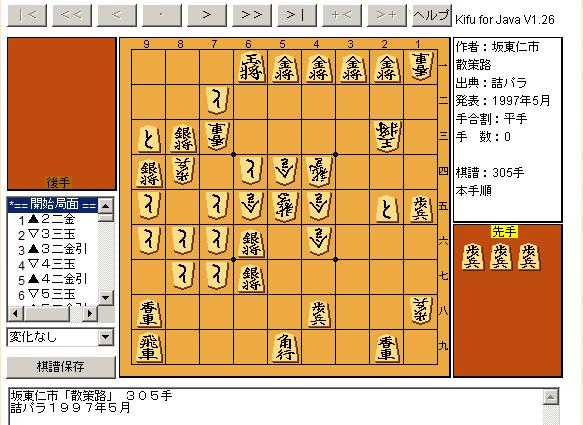

Kifu for JS [v5.3.0 マイナーリリース](https://github.com/na2hiro/Kifu-for-JS/releases/tag/v5.3.0)において、旧Kifu for Java/Flashタグの自動解釈方式を追加しました。

これは、既に作動できなくなっている旧Kifu for Javaや旧Kifu for Flashが設置されている古いページをお持ちの場合、タグを設置するだけで自動的にそれらの盤をKifu for JSに置き換えて表示することができる方式です。複雑な置換スクリプトなどを書くことなく、旧方式から手軽に移行することができます。

```html
<script>KifuForJS.recover()</script>
```

これだけです。詳しくは[盤の設置方式](/docs/getting-started/loading#kifu-for-javaflashの自動解釈方式)をご覧ください。

(旧Kifu for Java)


