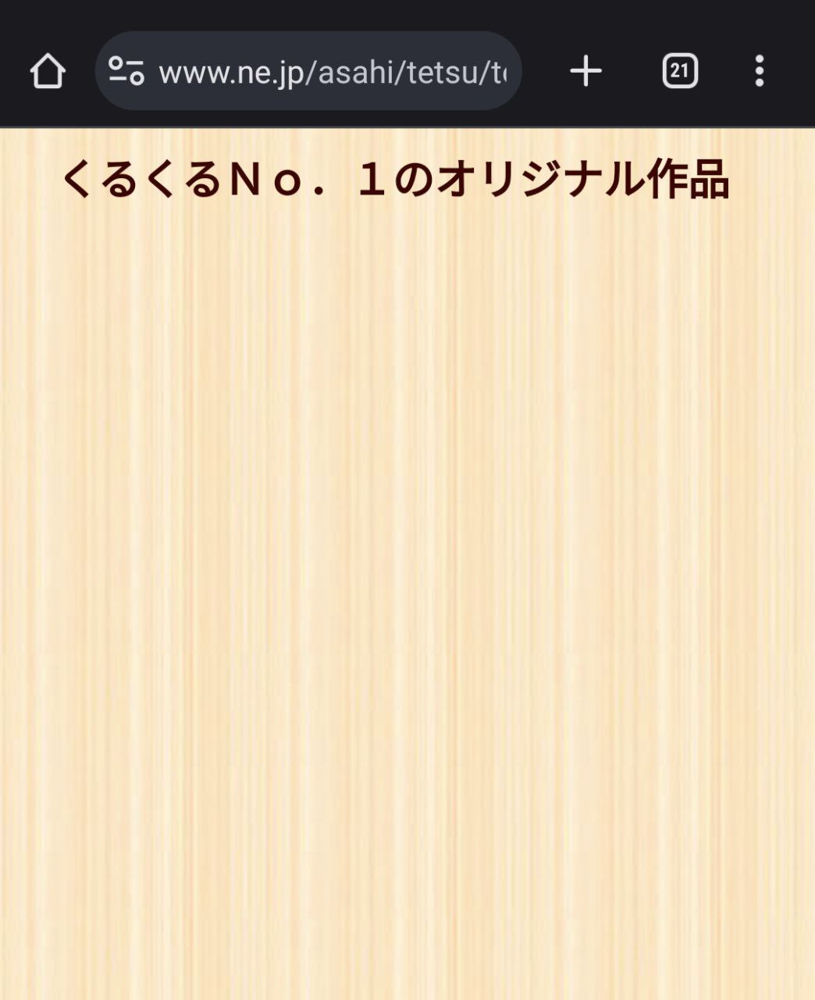

# Kifu for JS ブックマークレット

古いKifu for {Flash/Java}は既に動作が停止していますが、サイト運営者の手が回っておらずまだ設置されているページがある場合があります。Kifu for JSブックマークレットは、そんなページ上で訪問者が実行するだけで、Kifu for JSに置き換えて盤面を表示することができます。

## 準備

0. あらかじめ次のコードをURLとしてブックマークへ追加しておく。サイト名は任意（例：「Kifu for JS ブックマークレット」）

```javascript
javascript:!function(){var s=document.createElement("script");s.src="https://cdn.jsdelivr.net/npm/kifu-for-js@5/bundle/public-bookmarklet.min.js",document.body.appendChild(s)}();void 0;
```

## 使い方

1. 旧Kifu for Flashや旧Kifu for Javaが使われているページ ([例](https://www.ne.jp/asahi/tetsu/toybox/kurukuru/k001x.htm)) を開く



2. ブックマークレットを選択する


3. FlashやJava部分が置き換えられ，Kifu for JSの再生盤になる


