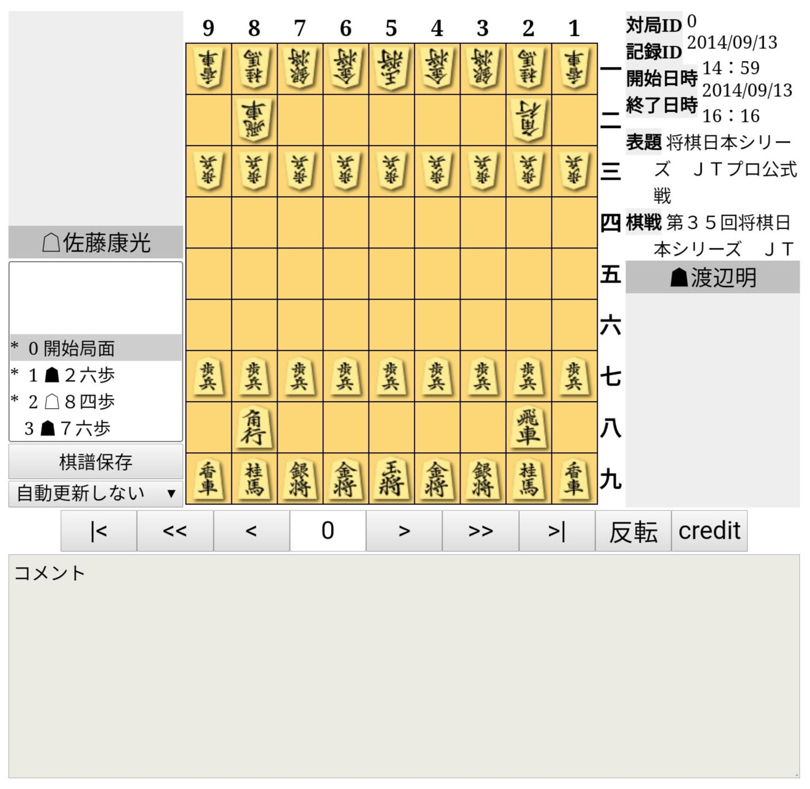

# Kifu for JS legacy版について

:::caution

このページは、Kifu for JS legacy版についての説明です。Kifu for JS の最新版については [Kifu for JS について](./) を参照してください。

:::

:::tip

現在Kifu for JS v4以前を使用していて最新版への移行を検討している場合は、[v4からv5への移行手順](./migration-from-4-to-5)を参照してください。

:::

Kifu for JS legacy版 は、Kifu for JS のv4以前で唯一サポートされていた棋譜再生盤です。v5以降でも使用はできますが、基本的に機能追加の予定はなく、新旧バージョンを併用したい方向けに残しています。




## 機能

Kifu for JS最新版にある機能のうち、次のものに対応しています。

* 簡単に設置できる
  * コードを埋め込むだけで動作、JSファイル等ダウンロードの必要なし
* 豊富な対応棋譜
  * 対応形式: KIF, KI2, CSA, [JKF](https://github.com/na2hiro/Kifu-for-JS/tree/master/packages/json-kifu-format)
  * 駒落ちや詰将棋等の初期局面指定された棋譜にも対応
  * 変化手順の再生に対応
  * json-kifu-formatパーサは2014年からオープンソースソフトウェアとしてメンテナンスされ、長年にわたりバグ修正や改良を重ねており、信頼性があります。
* プログラムへの組み込み対応
  * 盤面の状態を外部からコントロールできるAPIを提供

それに加え、legacy版独自で次の特徴・機能があります。

* Kifu for Java/Flashとの互換性を大部分保ったUI
  * 棋譜クリックや矢印キーでの再生など
  * 棋譜中継のための自動更新機能
* 棋譜入力機能
    * 再生中に本譜以外の手を進めることができる
    * 進めた手は変化手順(分岐)として格納
* 棋譜読み込み機能
    * 棋譜ファイルをドラッグ&ドロップで読み込み

Kifu for JS 最新版にあるような、次の機能は**ありません**。

* スマホに最適化された**UX (ユーザエクスペリエンス)**
  * 狭いスクリーンでも盤面が見やすいレイアウト
  * 盤面タップや棋譜スクロールによる棋譜再生
* 既存のサイト・ブログに合わせて**カスタマイズ可能**
  * 盤のレイアウトを崩さずに、表示したい大きさや領域にフィットできる

## legacy版の問題点

legacy版の更新を停止し、新しいバージョンへの移行を促している理由は２つあります。

Kifu for JS legacy版の1つ目の困難は、既存のサイトやブログへ組み込み見た目を整える必要性があったことです。

* Kifu for JS legacy版はHTMLのテーブルを含むDOMを出力していました。汎用的なCSSセレクタが使用されたサイトでは、例えばボタン上のテキストを太字にするといった指示が将棋再生盤のコントロールボタンにも適用されてしまいデザインが崩れるといったことです。
* また、駒台が横に広く、モバイルなどの横幅が狭い場合に盤面がスクリーンからはみ出しがちになり、CSSで外から調整しないといけない必要性がうまれることがありました。
* そもそも、見た目にもあまり美しくはありませんでした。

2つ目の困難は、モバイル（スマホ）でのユーザエクスペリエンスです。Kifu for Java/Flashが作られた2000年代はモバイル端末が誕生した頃で、将棋はパソコンで見るものでしたが、今やインターネットはモバイルでアクセスするのが当たり前です。Kifu for Java/FlashのUIを元にしたKifu for JS legacy版はモバイルでの使用上の不便な点が多くあります。

* 盤面が小さすぎ、見づらい（駒台が番の横で大きく使われているため。しかも２字駒）
* 進む、戻るなどの操作ボタンが小さすぎ、タップが難しい

Javaアプレットの終焉（2015年頃）、Flashの終焉（2020年頃）の後、Kifu for Java/Flashと同じUIでは古いと考えます。これらをすべて改善したのが、[Kifu for JS 最新版](./)です。legacy版(Kifu for JS@3かそれ未満)をご利用のサイト運営者の方は、ぜひ[Kifu for JS v5への移行](./migration-from-4-to-5)をお考えください。

## legacy版を利用する

:::info
旧版と最新版を混在させる場合は[v4からv5への移行手順](./migration-from-4-to-5#%E3%82%AA%E3%83%97%E3%82%B7%E3%83%A7%E3%83%B32-%E3%81%99%E3%81%A7%E3%81%AB%E3%81%82%E3%82%8B%E7%9B%A4%E3%81%AF%E3%81%9D%E3%81%AE%E3%81%BE%E3%81%BE%E3%81%AB%E6%9C%80%E6%96%B0%E7%89%88%E3%82%92%E6%B7%B7%E5%9C%A8%E3%81%95%E3%81%9B%E3%82%8B)をご覧ください。
:::

ページ内で１箇所、legacy版を含んだv5のスクリプトを読み込みます。

```html
<script src="https://cdn.jsdelivr.net/npm/kifu-for-js@5/bundle/kifu-for-js-legacy.min.js" charset="utf-8"></script>
```

その位置で盤を表示する場合は次のようにします。

```html
<script>Kifu.load("./files/kif/jt201409130101.kif");</script>
```

指定位置で表示する場合は次のようにします。

```html
<div id="board-1"></div>

<script>Kifu.load("./files/kif/jt201409130101.kif", "board-1");</script>
```
